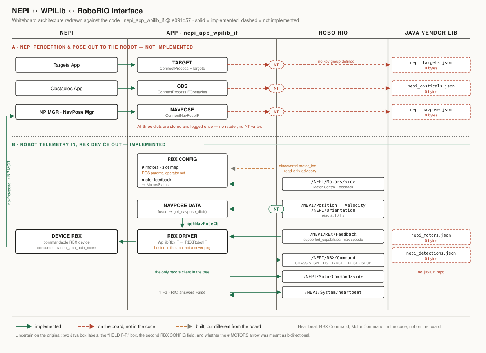

# Whiteboard Architecture vs. Implemented Code

Comparison of the hand-drawn NEPI / APP / RoboRIO architecture against
`nepi_app_wpilib_if` as it stands on `first_robotics` @ `e091d57`.

All line references are to that commit.

`architecture.svg` accompanies this document: the whiteboard's four columns
redrawn with the findings below layered on — solid green for implemented, dashed
red for drawn-but-absent, amber for built-but-different, plus the four paths that
exist in the code and were never drawn.



---

## How the board was read

Three columns, plus a Java column hanging off the right edge of the RoboRIO.

| Column | Boxes drawn |
|---|---|
| **NEPI** | One large box with ~6 topic lines leaving it; `NP MGR` (NavPose Mgr); `DEVICE RBX` at the bottom |
| **APP** | Upper half: `TARGET`, `OBS`, `NAVPOSE`, each with a line crossing into the RoboRIO column marked `NT`. Lower half, below a divider: `RBX CONFIG` (`# MOTORS`, `# ...`), `NAVPOSE DATA`, `GET NAVPOSE CB`, and an `RBX DRIVER` box on the NEPI/APP boundary |
| **ROBO RIO** | `NT` entry points per row; `HELD F-R` box at the bottom |
| **Java** | `HELPER`, `ARENA`(?), `HELP`(?) classes |

The load-bearing claim of the top half is a **direction**: NEPI's perception and
pose products flow *out* of NEPI, through the app, over NetworkTables, into the
RoboRIO, where Java helper classes present them to team code. The bottom half is
the reverse and is RBX-shaped: robot telemetry comes *in* over NT, becomes a
NavPose, and feeds an RBX device that NEPI sees as a robot.

The bottom half is built. The top half is not.

---

## What matches

### 1. The app is the sole NT client, and it owns the RoboRIO transport

One `ntcore` client lives in `scripts/nepi_wpilib.py`, started and stopped by the
app node (`wpilib_if_app_node.py:812`, `:831`). Nothing else in the tree imports
`ntcore`. This is the board's basic premise and it holds.

### 2. Three NEPI connect paths exist, named exactly as drawn

`setupInterfaceIFs` (`wpilib_if_app_node.py:1664`) builds the board's three
upper boxes:

| Board box | Code |
|---|---|
| `TARGET` | `ConnectProcessIFTargets` → `targetsConnectCb` (`:1672`, `:1735`) |
| `OBS` | `ConnectObstaclesIF` → `obstaclesConnectCb` (`:1715`, `:1744`) |
| `NAVPOSE` | `ConnectNavPoseIF` → `navposeConnectCb` (`:1679`, `:1754`) |

Each has a RUI selector (`rui/NepiAppWpilibIF.js:826-890`). The `NAVPOSE`
selector binds to the NavPose Mgr's published pose, which is the board's `NP MGR`
line.

### 3. `RBX DRIVER` straddling the NEPI/APP boundary

The board draws the RBX driver at the boundary rather than cleanly inside either
column, and that is what the code does: `WpilibRbxIF` (`scripts/wpilib_rbx_if.py`)
is constructed *by the app node* (`wpilib_if_app_node.py:1567`) but wraps a real
`RBXRobotIF` (`wpilib_rbx_if.py:187`), so the resulting device is an ordinary
NEPI RBX device.

This was a deliberate decision, not a drift — `WPILIB_IF_DESIGN.md` Decision 3
picks "Option A: app node hosts one RBXRobotIF" over a separate
`nepi_drivers` package, because a driver process would mean a second NT client.
The module is deliberately self-contained so the move to a driver is a file move
plus a transport swap.

### 4. `DEVICE RBX` appearing in NEPI, and its line up to `NP MGR`

Both sides of that drawn connection are real. `RBXRobotIF` publishes the RBX
device under NEPI, and because `getNavPoseCb` is supplied (`wpilib_rbx_if.py:262`)
it also constructs an `NPXDeviceIF` → `NavPoseIF` and publishes pose at
`<node>/npx/navpose` (`wpilib_if_app_node.py:1503`). That pose is what the NavPose
Mgr aggregates — the curved line from `DEVICE RBX` back up to `NP MGR`.

### 5. `NAVPOSE DATA` → `GET NAVPOSE CB` → RBX driver

The board's lower navpose path is implemented exactly as drawn, including the
callback name. NT position/velocity/orientation are read at 10 Hz
(`wpilib_if_app_node.py:952-954`), fused into one NavPose dict by
`get_navpose_dict` (`:1417`), and handed to the RBX device as `getNavPoseFunction`
(`:1573`), which `WpilibRbxIF` exposes as `getNavPoseCb` (`wpilib_rbx_if.py:769`).

`WPILIB_IF_DESIGN.md` Decision 4 explains why this callback is mandatory rather
than optional: `RBXRobotIF`'s goto commands are blocking convergence loops that
read `current_position_enu_m`, and that attribute is refreshed *only* from
`getNavPoseCb`.

### 6. Motor telemetry flowing RoboRIO → app

`read_all_motor_feedback` runs every poll (`wpilib_if_app_node.py:950`), and
discovered RoboRIO `motor_id`s are cached in `nt_motor_ids` (`:951`). Motor
feedback is republished on the standard NEPI contract as
`nepi_interfaces/MotorsStatus` via `MotorsDeviceIF` (`:1263`).

---

## What differs

### A. The top half of the board is not wired — TARGET, OBS and NAVPOSE never reach NetworkTables

**This is the single largest gap.** The board shows all three crossing into the
RoboRIO column. In the code they stop at the app.

Every NT write in the node, exhaustively:

| Line | Write |
|---|---|
| `wpilib_if_app_node.py:876` | `publish_heartbeat` |
| `wpilib_if_app_node.py:1339` | `write_motor_command` |
| `wpilib_if_app_node.py:1633` | `write_rbx_command_request` |

There is no fourth. Correspondingly, `nepi_wpilib.py` declares NT key groups for
`/NEPI/Motors`, `/NEPI/MotorCommand`, `/NEPI/Position`, `/NEPI/Velocity`,
`/NEPI/Orientation`, `/NEPI/RBX/Feedback` and `/NEPI/RBX/Command`
(`nepi_wpilib.py:87-108`) — and **no group for targets, obstacles or
detections**. The contract for the board's top half does not exist yet, on
either side of the wire.

What the three callbacks actually do today is store the dict and log it once:

```
self.targets_dict = data_dict          # wpilib_if_app_node.py:1732
self.obstacles_dict = data_dict        # :1741
self.navpose_dict = data_dict          # :1751
```

Grepping those three attributes across `scripts/` returns only the assignment,
the declaration, and the log line. They have no other reader. The connect
plumbing and the RUI selectors are in place; the NT publish stage behind them is
missing.

### B. The two NavPose boxes are different NavPoses, flowing opposite ways

Worth stating explicitly because the board's two `NAVPOSE` boxes look related and
are not:

- **Upper `NAVPOSE`** — NEPI's own fused pose from the NavPose Mgr, drawn heading
  *out* to the RoboRIO. Received (`ConnectNavPoseIF`), stored in
  `self.navpose_dict`, **never sent**.
- **Lower `NAVPOSE DATA`** — the robot's pose from the RoboRIO, heading *in*.
  Fully implemented (`get_navpose_dict`, `:1417`).

The name collision is a documentation hazard: `self.navpose_dict` (the unused
inbound-from-NEPI one) and the return of `get_navpose_dict()` (the live
from-RoboRIO one) are unrelated values one identifier apart.

### C. `RBX CONFIG` — `# MOTORS` is operator-configured, not read from the robot

The board draws `# MOTORS` and the field below it arriving *from* the RoboRIO
into the app's RBX config. In the code the motor model is a persisted ROS param
set by an operator:

- `motor_slot_count` — param, factory default 4 (`wpilib_if_app_node.py:219`,
  `:319`), operator-settable via `set_motor_slot_count` (`:408`).
- `motor_ids` — ordered param list, `-1` = unmapped (`:597`).
- `motor_names` — operator display names (`:616`).

The RoboRIO's contribution is advisory only: discovered `motor_id`s are read from
NT and shown read-only beside the editor, but nothing sizes or populates the
slots from them.

This too is a decision rather than an oversight — `WPILIB_IF_DESIGN.md`
Decision 2 rejects a discovered-ids dropdown because it would make the app
unconfigurable during pit bring-up, when NEPI is up and the robot code is not.
**Flagging it because the board and the code disagree on the arrow direction, and
someone reading only the board would expect slot config to appear by itself when
the robot boots.**

### D. The Java vendor library is empty files

The board's right-hand `HELPER` column is where NEPI data would be presented to
team code. `nepi_wpilib_vender_lib/lib/` contains exactly the five files that
column implies:

```
nepi_detections.json   0 bytes
nepi_motors.json       0 bytes
nepi_navpose.json      0 bytes
nepi_obsticals.json    0 bytes
nepi_targets.json      0 bytes
```

All five are zero bytes, and there is no `.java` anywhere in the repo. Note that
three of the five names — targets, obstacles, detections — are precisely the
products blocked by gap A. The RoboRIO-side half of the top row is a stub on both
the NEPI side and the Java side.

### E. Things in the code that the board does not show

Not contradictions, but the board is not a complete map of the interface:

| Not on the board | Where |
|---|---|
| **Heartbeat** — NEPI writes `True` at 1 Hz, RoboRIO answers `False` after ~500 ms | `nepi_wpilib.py:71`, node `:859`, `:887` |
| **RBX Command Request** — the app's main *outbound* command path (CHASSIS_SPEEDS / TARGET_POSE / NAMED_ACTION / STOP) | `nepi_wpilib.py:911`, node `:1610` |
| **Per-motor Motor Command** writes at `/NEPI/MotorCommand/<id>/` | `nepi_wpilib.py:969`, node `:1312` |
| **`GOTO_VELOCITY`** — 10 Hz streamed velocity against a 250 ms RoboRIO watchdog | `wpilib_rbx_if.py:646`, `docs/ROBORIO_VELOCITY_CONTRACT.md` |
| **Capability negotiation** — the RBX device is not built until the RoboRIO advertises `supported_capabilities`, and a changed list forces a rebuild | node `:1524` |
| **Test mode** — synthesizes all five inbound NT groups so RBX comes up with no RoboRIO attached; explicitly temporary scaffolding | `scripts/wpilib_test_mode.py` |

The board also implies nothing about `rbx_enabled`, which is **off by default**
(`FACTORY_RBX_ENABLED = False`, `:90`). Until an operator turns it on there is no
RBX device and no NavPose publication at all.

---

## Summary

| Board element | Status |
|---|---|
| App owns the only NT client | **Same** |
| TARGET / OBS / NAVPOSE connect paths exist in app | **Same** |
| TARGET → NT → RoboRIO | **Missing** — no writer, no NT key group |
| OBS → NT → RoboRIO | **Missing** — no writer, no NT key group |
| NAVPOSE (NEPI → RoboRIO) | **Missing** — received and stored, never written |
| `RBX DRIVER` on the NEPI/APP boundary | **Same** (hosted in app by design; driver package deferred) |
| `DEVICE RBX` published into NEPI | **Same** |
| `DEVICE RBX` → `NP MGR` | **Same** (via `NPXDeviceIF` → `NavPoseIF`) |
| `NAVPOSE DATA` (RoboRIO → app) | **Same** |
| `GET NAVPOSE CB` → RBX driver | **Same**, including the name |
| `RBX CONFIG` / `# MOTORS` sourced from RoboRIO | **Different** — operator params; discovered ids are read-only advisory |
| Java `HELPER` classes | **Missing** — five zero-byte JSON stubs, no Java |
| Heartbeat, RBX Command Request, Motor Command, GOTO_VELOCITY | **Extra** — implemented, not drawn |

Bottom half: built and matching. Top half: connected on the NEPI side, absent on
the NT side, stubbed on the Java side.

---

## Uncertain readings

Flagged rather than guessed at, since the comparison above does not depend on
them:

- Two of the three Java box labels (`ARENA`?, `HELP`?) and the `HELD F-R` box at
  the bottom of the RoboRIO column could not be read with confidence. Nothing in
  the repo obviously corresponds to them.
- The `# MOTORS` row is drawn with arrowheads at both ends. It was read as
  RoboRIO → app. If it was meant as bidirectional (app pushes the slot mapping
  to the RoboRIO and the RoboRIO reports its motor count back), then difference C
  is larger than described: there is no NT key group for a slot mapping in
  either direction.
- The second `RBX CONFIG` field under `# MOTORS` is illegible.
